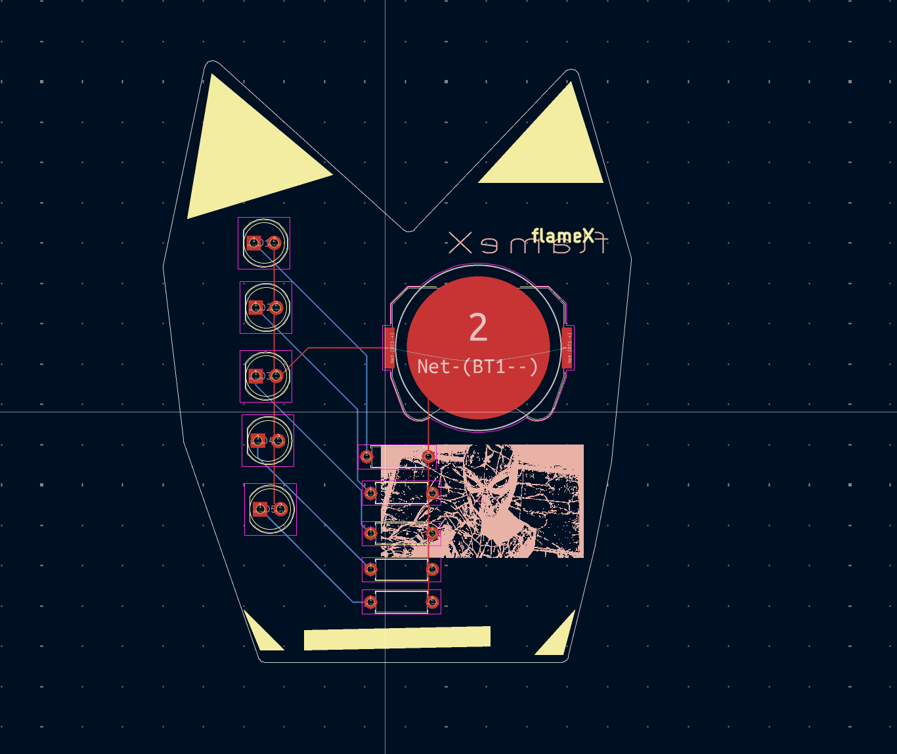

# solder-ysws

The main function of the PCB is that there is a button which will control the functioning of all the LEDs present in the board. 

## Schematic

## PCB

## How to build
place the parts according to schematic and solder them EZZZZ
## BOM
- 1 	Battery
- 5   LED
- 5	  470 Resistor

Made by flameX!!

Made as a part of http://solder.hackclub.com/!
