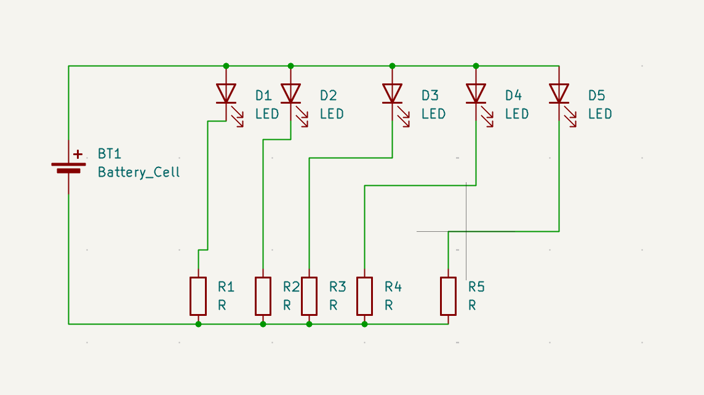
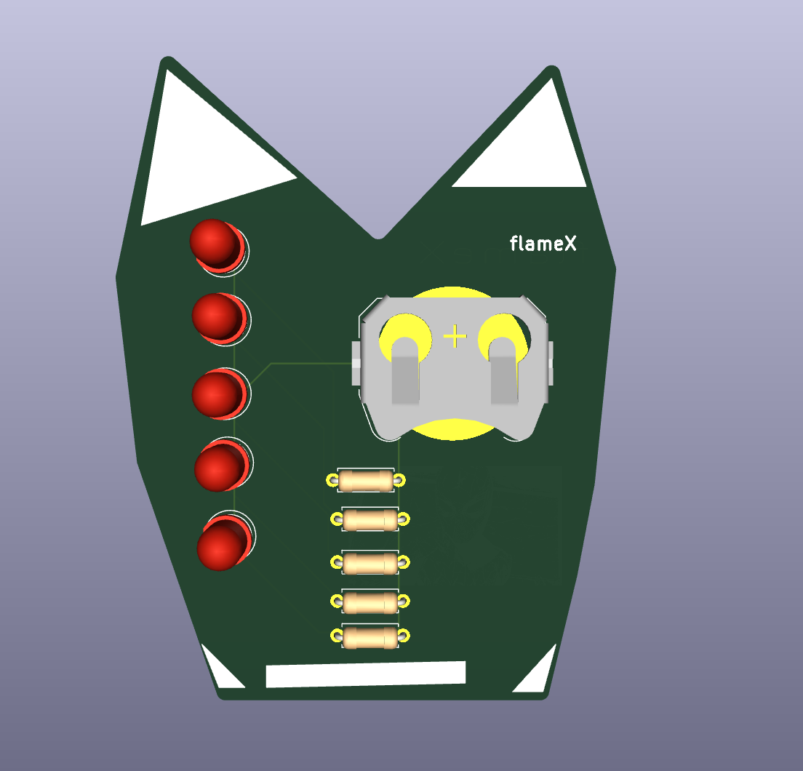

# solder-ysws

The main function of this PCB is that it looks ilke a some kinda kitty but its irregular in shape lowk , and it runs on a CR2032 battery 
## Schematic

## PCB

## How to build
place the parts according to schematic and solder them; EZZZZ
## BOM
- 1 	Battery
- 5   LED
- 5	  470 Resistor

Made by flameX!!

Made as a part of http://solder.hackclub.com/!
